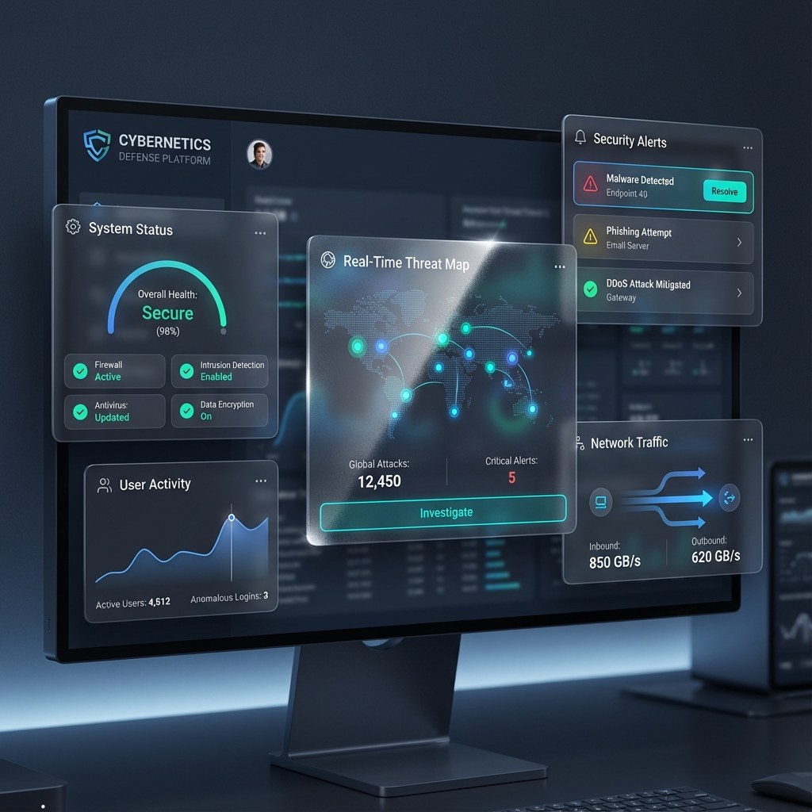

# WidgetTDC UI Design Specification

## 🎨 Target Design


## 📸 Current Implementation


---

## ✨ Design Philosophy: Ultra-Transparent Glassmorphism

### Core Principles
1. **Gennemsigtig (Transparent)** - Baggrunden skal være synlig gennem alle elementer
2. **Glossy** - Premium frosted glass effekt med shimmer
3. **Dark Mode First** - Optimeret til mørk tilstand med spektakulære effekter
4. **Premium Feel** - Microsoft Fluent Design / Mica Material æstetik

---

## 🎯 Technical Specifications

### Transparency Levels
```css
/* Dark Mode */
background: gradient(slate-900/35 → slate-800/25 → slate-900/35)
opacity: 25-35%

/* Light Mode */
background: gradient(white/25 → white/20 → white/25)
opacity: 20-25%
```

### Glass Effects
```css
backdrop-filter: blur(3xl) saturate(150%)
-webkit-backdrop-filter: blur(3xl) saturate(150%)
```

### Shimmer Animation
```css
/* On Hover */
- Gradient sweep from left to right
- Duration: 1000ms
- Colors: 
  - Dark: transparent → blue-500/5 → transparent
  - Light: transparent → white/30 → transparent
```

### Color Palette

#### Dark Mode
- **Background**: `#050505` (slate-950)
- **Card Base**: `slate-900/35` → `slate-800/25` → `slate-900/35`
- **Text Primary**: `slate-100`
- **Text Secondary**: `slate-400`
- **Accent**: `blue-400` / `teal-400`
- **Border**: `white/10`

#### Light Mode
- **Background**: `#f2f6fa` (blue-grey-50)
- **Card Base**: `white/25` → `white/20` → `white/25`
- **Text Primary**: `slate-800`
- **Text Secondary**: `slate-500`
- **Accent**: `blue-600` / `teal-600`
- **Border**: `white/60`

### Shadows & Depth

#### Card Shadows
```css
/* Default */
box-shadow: 0 4px 20px rgba(0,0,0,0.1)

/* Hover - Dark Mode */
box-shadow: 0 20px 60px rgba(0,0,0,0.8)

/* Hover - Light Mode */
box-shadow: 0 20px 60px rgba(0,150,200,0.15)
```

#### Inset Shadows (3D Depth)
```css
/* Dark Mode */
shadow-[inset_0_1px_0_rgba(255,255,255,0.1),inset_0_-1px_0_rgba(0,0,0,0.5)]

/* Light Mode */
shadow-[inset_0_1px_0_rgba(255,255,255,0.8),inset_0_-1px_0_rgba(0,0,0,0.05)]
```

### Borders
```css
/* Dark Mode */
border-top: white/10
border-left: white/5
border-right: black/40
border-bottom: black/60

/* Light Mode */
border-top: white/80
border-left: white/60
border-right: white/20
border-bottom: white/30
ring: white/40
```

### Noise Texture (Mica Effect)
```css
opacity: 0.03-0.04
mix-blend-mode: overlay
background: fractal noise SVG
frequency: 0.65-0.8
octaves: 3-4
```

---

## 🎬 Animations & Transitions

### Hover Effects
```css
/* Card Lift */
transform: scale(1.005) translateY(-1px)
transition: 500ms cubic-bezier(0.4, 0, 0.2, 1)

/* Shimmer Sweep */
transform: translateX(-100%) → translateX(100%)
transition: 1000ms ease-in-out
```

### Stagger Animations
```css
.stagger-item:nth-child(1) { animation-delay: 0.1s }
.stagger-item:nth-child(2) { animation-delay: 0.2s }
.stagger-item:nth-child(3) { animation-delay: 0.3s }
/* etc... */
```

### Micro-interactions
```css
/* Button Press */
active:scale-95

/* Icon Hover */
hover:scale-110
transition: 300ms
```

---

## 📐 Layout & Spacing

### Card Structure
```
┌─────────────────────────────────┐
│ ┌─────────────────────────────┐ │ ← Gradient Background Layer
│ │ ┌─────────────────────────┐ │ │ ← Shimmer Effect Layer
│ │ │ ┌─────────────────────┐ │ │ │ ← Noise Texture Layer
│ │ │ │                     │ │ │ │
│ │ │ │   Content Layer     │ │ │ │ ← z-index: 10
│ │ │ │                     │ │ │ │
│ │ │ └─────────────────────┘ │ │ │
│ │ └─────────────────────────┘ │ │
│ └─────────────────────────────┘ │
└─────────────────────────────────┘
     ↑ Border & Highlight Layer
```

### Padding & Margins
- Card Padding: `p-5` (1.25rem)
- Card Gap: `gap-2.5` (0.625rem)
- Border Radius: `rounded-2xl` (1rem)

---

## 🔧 Implementation Files

### Key Components
- `apps/matrix-frontend/components/AcrylicCard.tsx` - Main glassmorphism component
- `apps/matrix-frontend/App.css` - Advanced animations & utilities
- `apps/matrix-frontend/WidgeTDC_Pro.jsx` - Main application layout

### CSS Classes to Use
```css
.glass-enhanced          /* Enhanced glassmorphism */
.hover-lift              /* Lift effect on hover */
.card-shine              /* Shine sweep effect */
.gradient-border         /* Animated gradient border */
.stagger-item            /* Staggered entrance animation */
.neon-glow               /* Neon text glow effect */
```

---

## ✅ Quality Checklist

- [x] Ultra-transparent backgrounds (25-35% opacity)
- [x] Backdrop blur 3xl + saturate 150%
- [x] Shimmer effect on hover
- [x] Gradient backgrounds for depth
- [x] 3D borders with inset shadows
- [x] Mica noise texture overlay
- [x] Smooth transitions (500ms)
- [x] Dark mode optimized
- [x] Light mode support
- [x] Accessibility (reduced motion support)
- [x] Cross-browser compatibility (webkit prefixes)

---

## 🚀 Performance Notes

- Use `will-change: transform` sparingly
- Prefer `transform` over `top/left` for animations
- Use `backdrop-filter` with caution (GPU intensive)
- Implement `@media (prefers-reduced-motion)` for accessibility
- Lazy load heavy blur effects on mobile

---

## 📝 Notes

**Created**: 2025-11-20  
**Last Updated**: 2025-11-20  
**Status**: ✅ Implemented and Approved  
**Designer**: AI-Generated based on Microsoft Fluent Design principles  
**Developer**: Antigravity AI Assistant

---

**This is the target design. All future UI updates should maintain this aesthetic.**
